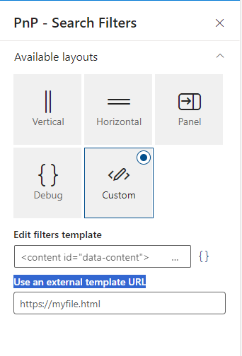

# pnp-modern-search-layouts
Community contributed layouts to be used in the PnP Modern Search solution

## How to use these layouts
1. Download the layouts you want to use
2. Upload them to a document library in your tenant
3. Copy the URL of the layout you want to use
4. Paste the URL in the "Use and external template URL" property of the PnP Modern Search web part
5. Configure the web part as you want

## How to contribute
1. Fork this repository
2. Add your layout in a new folder
3. Add a README.md file in your folder to describe your layout
4. Add a screenshot of your layout in your folder

## Refiner Layouts 
[Refiner Layouts](Refiner/Refiner%20layouts.md)

## Search Results Layouts
[Search Results Layouts](Search%20Results/Search%20Results%20Layouts.md)