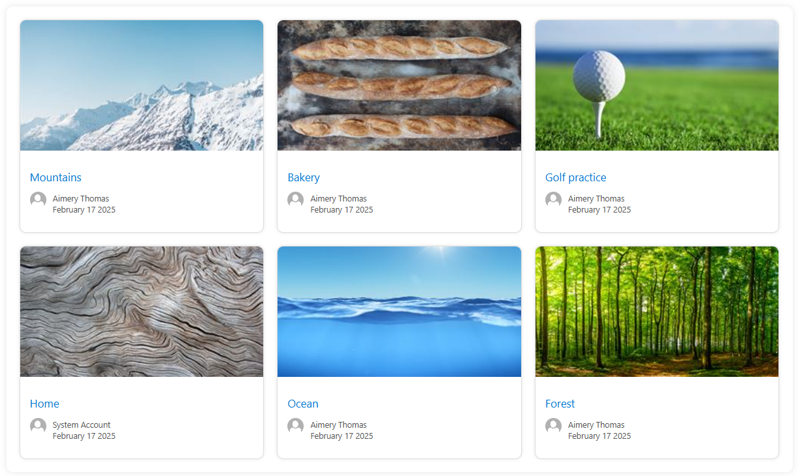

# Banner Cards layout
This template is a grid view that renders search results in *nearly* the same style as the default Cards layout.
It emphasis on thumbnail image by making it bigger and displaying less additional details.
It can be especially useful for pages with a banner image.

## Banner cards search results


## Additional Properties required in `selected properties`
The following additional properies are needed in the search results:
* `LastModifiedTime`

## Results template (rendering template)
The custom template is built on HTML and CSS, no additional plugins or libraries are needed.

```html
    <content id="data-content">
        <style>
            body {
                font-family: Arial, sans-serif;
                display: flex;
                justify-content: center;
                align-items: center;
                height: 100vh;
                margin: 0;
                background-color: #f0f0f0;
            }
            .grid-container {
                display: grid;
                grid-template-columns: repeat(3, 1fr);
                gap: 20px;
                padding: 20px;
                background-color: #fff;
                border-radius: 10px;
                box-shadow: 0 0 10px rgba(0, 0, 0, 0.1);
            }
            .card {
                background-color: #fff;
                border: 1px solid #ddd;
                border-radius: 10px;
                overflow: hidden;
                box-shadow: 0 0 5px rgba(0, 0, 0, 0.1);
            }
            .card img {
                width: 100%;
                height: 200px; /* Set a fixed height */
                object-fit: cover; /* Maintain aspect ratio */
                margin-bottom: 10px;
            }
            .card-content {
                padding: 15px;
            }
            .card-title {
                font-size: 1.2em;
                margin: 0 0 10px;
                color: #0078d4;
                text-decoration: none;
            }
            .card-meta {
                font-size: 0.9em;
                color: #555;
            }
            .author {
                display: flex;
                align-items: center;
            }
            .author img {
                width: 25px;
                height: 25px;
                border-radius: 50%;
                margin-right: 10px;
            }
        </style>
        <div class="grid-container">
            {{#each data.items as |item|}}
            <div class="card">
                
                <div class="card-content">
                    <a href="{{item.Path}}" class="card-title">{{item.Title}}</a>
                    <div class="author">
                        
                        <p class="card-meta"><span>{{#with (split (slot item @root.slots.Author) '|')}}
            {{[1]}}
            {{/with}}</span><br>{{getDate item.LastModifiedTime "MMMM DD YYYY"}}</p>
                    </div>
                </div>
            </div>
            {{/each}}
        </div>
    {{#if @root.properties.paging.showPaging}}

    {{#gt @root.data.totalItemsCount @root.properties.paging.itemsCountPerPage}}
    <pnp-pagination data-total-items="{{@root.data.totalItemsCount}}"
    data-hide-first-last-pages="{{@root.properties.paging.hideFirstLastPages}}"
    data-hide-disabled="{{@root.properties.paging.hideDisabled}}"
    data-hide-navigation="{{@root.properties.paging.hideNavigation}}" data-range="{{@root.properties.paging.pagingRange}}"
    data-items-count-per-page="{{@root.properties.paging.itemsCountPerPage}}"
    data-current-page-number="{{@root.paging.currentPageNumber}}" data-theme-variant="{{JSONstringify @root.theme}}">
    </pnp-pagination>
    {{/gt}}

    {{/if}}
    </content>
```

## Query template suggestion
List all pages on the current site:
```{searchTerms} Path:{Site} IsDocument:"True" FileExtension:aspx```