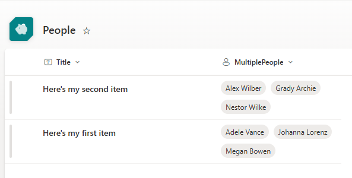
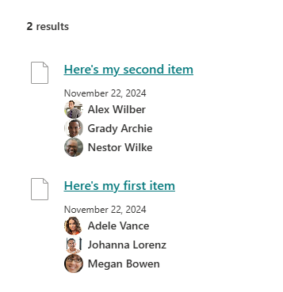

# Multiple people display for a search result item #

For details on how to display Microsoft Graph Toolkit person components for a multiple people field in a SharePoint list or library, see this blog post: [https://corriehaffly.wordpress.com/2024/11/22/displaying-multiple-people-in-pnp-modern-search/](https://corriehaffly.wordpress.com/2024/11/22/displaying-multiple-people-in-pnp-modern-search/)

1. Create a site column of Person or Group type, with multiple selections enabled.
2. Add the site column to your list or library. Add data and wait for SharePoint search to crawl the data.
3. Map the crawled property (the q_USER one) to a refinablestring managed property via the SharePoint admin center > more > search > search schema > managed properties.
4. Reindex your list or library so that the managed property gets populated.
5. Configure your PnP modern search result web part with a query to retrieve your list or library results.
6. Add your refinablestring managed property to the selected properties list.
7. Set up a new layout slot for "MultPeopleQ" and set it to your refinablestring managed property.
8. In the next panel, click the toggle for "Use Microsoft Graph Toolkit" to turn it on.
9. Use this custom .html layout file in your results, or update your own custom layout template with the code snippet below.

        {{#each (split (slot item @root.slots.MultPeopleQ) ";") as |person|}}
         <mgt-person user-id="{{getUserEmail person}}" view="oneline" person-card="hover">
         </mgt-person>
        {{/each}}