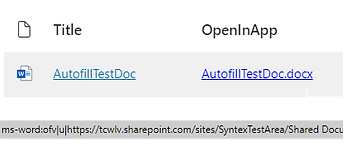

# Handlebar expression when you want the link to open as read only in the Office App #

Your can read more about this handlebar expression at [M365Thinking blog](https://www.m365thinking.com/post/using-office-uri-schemes-to-open-search-results-in-the-application)

The Handlebar is here [Handlebars/Open Links in application](openInAppHandlebar.txt)

