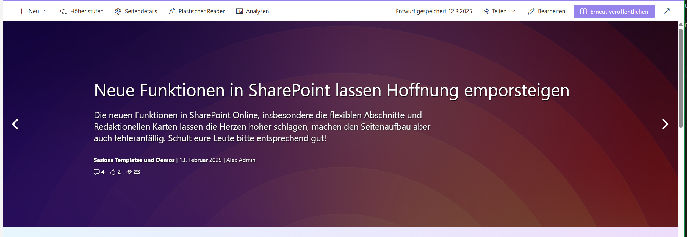

# VALO Style News Slider Template

Ever thought about havong a beautiful slider, but the standard SharePoint one just doesn'T do the trick? (It's rather ugly and simple)

In this example you can create a VALO inspired (it has been a pretty 3rd party framework that has recently been discontinued) Slider that can expand over the whole page width with a full width zone or just anywhere you want on a page. It is responsive and resized nicely. CSS layering is used for container inline size awareness! 

You can just fetch some PromotedState=2 items and add the template, the slilder options are within the template and can be configured as documented in the PnP flickity slilder documentation. Did some CSS fumblings to get it to display only one big image. 

## Slots the template uses

- **Date:** Used for displaying the Date, supposed to get FirstPublishedDate Property
- **Title:** Of course used to display Title property
- **Summary:** Used to display a teaser text - takes the Description property
- **Site:** OPTIONAL Use to display the SiteTitle or Something like TopicHeader
- **Author:** Use to display the Author, only works with DisplayAuthor at the moment!
- **Tags:** OPTIONAL Use to display Tags like from owsmetadataalltagsinfo or any other Tag Property
- **Likes:** OPTIONAL Use to display number of Likes, takes LikeCount Property, is not really up to date because new Likes are not immediately  indexed
- **Comments:** OPTIONAL Use to display number of Comments, takes CommentCount Property, is not really up to date because new Comments are not immediately  indexed
- **Views:** OPTIONAL Use to display number of Views, takes ViewsLifeTime Property, is not really up to date because new Views are not immediately indexed but the most useful and accurate or so it seems

## Stuff to do in the template code

Within the Template Code you can change the slider behavior like time to change slides or if it even slides automatically. 

Also the slider height ist changeable in the code, default is 500px.

There is some custom placeholdercontent displaying a message that you can change, also remember to also change the height of the placeholder for a smooth rendering experience.

### Be aware

...of using multiple versions of the html template with different heights and settings on the same page. You can do that, but need to rename the template AND the wrapper classes in the code to something different, so the CSS layer code doesn't interfere with the wrong template. 

Have fun!
