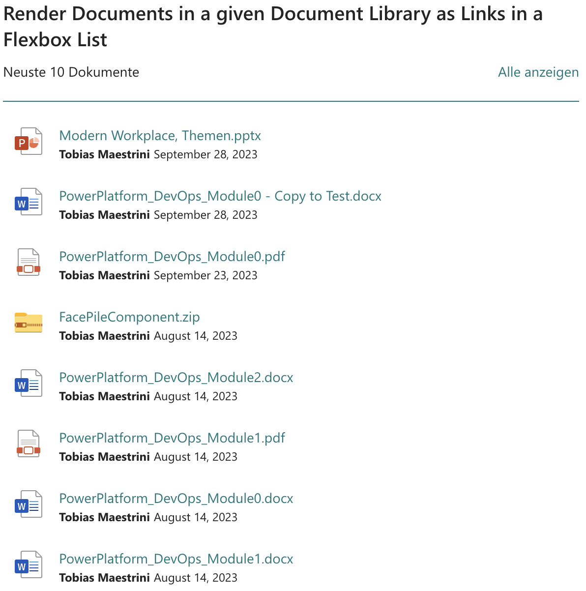
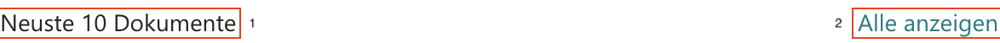

# Display the top *n* documents in a list – based on query
This template renders search results in a list view, based on a flexbox list layout – inspired by the "Document library" webpart (one of the out-of-the-box webparts) but with a lot more flexibility! The search results are built upon your custom search query, and the results template can be populated according to your needs. It bases on the inital settings of the `List` layout.



Configure the setting `itemsCountPerPage` to only show the first `n` items!


## Additional Properties (in `selected properties`)
The following additional properties are needed in the results template: 
* `LastModifiedTimeForRetention`
* `FileName`


## Results template (rendering template)
In order to make the file type displayable, make sure you have set the property `showFileIcon` to true (you can find it in `layoutProperties`). The easiest way to achieve is is to setup List as layout option, activate `Show file icon` to `true` and change the results template afterwords with the content from above.

The custom template is built on HTML and CSS, no additional plugins or libraries are needed.

### Adjust the top bar
Adjust the HTML elements of the following two components whithin the top bar according to your needs and language:



1. «Neuste `n` Dokumente» (aka "recent `n` documents"): the count of displayed documents (`n`) 
  <br>👉 defined in the setting `itemsCountPerPage` 
1. «Alle anzeigen» (aka "Show all"): also point the link target to the destination library (or any target)
  <br>👉 replace `<link to the reference library or target>` with your target link


### Rendering template

```html
<content id="data-content">

    <style>
        /* Insert your CSS overrides here */
        
        .example-themePrimary a {
            color: {{ @root.theme.palette.themePrimary }};
            text-decoration: none;
        }
        
        {
            {
                #unless @root.properties.layoutProperties.showItemThumbnail
            }
        }
        .template--listItem {
            min-height: inherit;
        }
        .template--listItem--result {
            flex-basis: 100%!important;
            max-width: 100%;
        }
        .template--header-text {
            display: flex;
            justify-content: space-between;
            padding-bottom: 1.5em;
            border-bottom: 1px solid {{ @root.theme.palette.themePrimary }};
        }
        
        {
            {
                /unless
            }
        }
    </style>

    <div class="template">

        <div class="template--header-text example-themePrimary">
            <!-- 👇 Adjust this text according to your language -->
            <div>Neuste {{@root.properties.paging.itemsCountPerPage}} Dokumente</div>
            <!-- 👇 Adjust this link (in the href tag) with the url to the destination library or (any target) -->
            <div><a href="<link to the reference library or target>" target="_blank" style="color:{{@root.theme.semanticColors.link}}" data-interception="off" rel="noopener noreferrer">Alle anzeigen</a></div>
        </div>
        <ul class="template--defaultList">
            {{#each data.items as |item|}}
                <pnp-select 
 data-enabled="{{@root.properties.itemSelectionProps.allowItemSelection}}" 
 data-index="{{@index}}" 
 data-is-selected="{{isItemSelected @root.selectedKeys @index}}">

                    <template id="content">

                        <li class="template--listItem">
                            {{#> resultTypes item=item}}
                            <div class="template--listItem--result">
                                {{#if @root.properties.layoutProperties.showFileIcon}}
                                {{#contains "['STS_Site','STS_Web']" (slot item @root.slots.contentclass)}}
                                    <pnp-iconfile class="template--listItem--icon" data-extension="{{slot item @root.slots.FileType}}" data-is-container="{{slot item @root.slots.IsFolder}}" data-image-url="{{item.SiteLogo}}" data-size="32" data-theme-variant="{{JSONstringify @root.theme}}"></pnp-iconfile>    
                                {{else}}
                                    <pnp-iconfile class="template--listItem--icon" data-extension="{{slot item @root.slots.FileType}}" data-is-container="{{slot item @root.slots.IsFolder}}" data-size="32" data-theme-variant="{{JSONstringify @root.theme}}"></pnp-iconfile>
                                {{/contains}}
                                {{/if}}
                                <div class="template--listItem--contentContainer">
                                    <span class=" example-themePrimary">
                                        <a href="{{slot item @root.slots.PreviewUrl}}" target="_blank" style="color:{{@root.theme.semanticColors.link}}" data-interception="off" rel="noopener noreferrer">{{Filename}}</a>
                                    </span>
                                    <span>                            
                                        <span class="template--listItem--author">
                                            {{#with (split (slot item @root.slots.Author) '|')}}
                                                {{[1]}}
                                            {{/with}}
                                        </span>
                                        <span class="template--listItem--date">{{getDate LastModifiedTimeForRetention "LL"}}</span>                            
                                    </span>                        
                                </div>
                            </div>
                            {{/resultTypes}}
                        </li>
                    </template>

                </pnp-select>
            {{/each}}
        </ul>

        {{#if @root.properties.paging.showPaging}} {{#gt @root.data.totalItemsCount @root.properties.paging.itemsCountPerPage}}
        <pnp-pagination data-total-items="{{@root.data.totalItemsCount}}" data-hide-first-last-pages="{{@root.properties.paging.hideFirstLastPages}}" data-hide-disabled="{{@root.properties.paging.hideDisabled}}" data-hide-navigation="{{@root.properties.paging.hideNavigation}}"
 data-range="{{@root.properties.paging.pagingRange}}" data-items-count-per-page="{{@root.properties.paging.itemsCountPerPage}}" data-current-page-number="{{@root.paging.currentPageNumber}}"
 data-theme-variant="{{JSONstringify @root.theme}}">
        </pnp-pagination>
        {{/gt}} {{/if}}

    </div>
</content>

<content id="placeholder-content">
    <style>
        /* Insert your CSS overrides here */
    </style>

    <div class="placeholder">
        {{#if @root.properties.showResultsCount}}
        <div class="template--resultCount">
            <span class="placeholder--shimmer placeholder--line" style="width: 20%"></span>
        </div>
        {{/if}}
        <ul class="template--defaultList">
            {{#times @root.properties.paging.itemsCountPerPage}}
            <li class="template--listItem" tabindex="0">
                <div class="template--listItem--result">
                    {{#if @root.properties.layoutProperties.showFileIcon}}
                    <div class="template--listItem--icon placeholder--shimmer "></div>
                    {{/if}}
                    <div class="template--listItem--contentContainer">
                        <span class="placeholder--shimmer placeholder--line" style="width: 60%"></span>
                        <span class="placeholder--shimmer placeholder--line" style="width: 100%"></span>
                        <span class="placeholder--shimmer placeholder--line" style="width: 100%"></span>
                        <span class="placeholder--shimmer placeholder--line" style="width: 35%"></span>
                        <span class="placeholder--shimmer placeholder--line" style="width: 20%"></span>
                    </div>
                </div>
                {{#if @root.properties.layoutProperties.showItemThumbnail}}
                <div class="template--listItem--thumbnailContainer">
                    <div class="thumbnail--image">
                        <div class="placeholder--shimmer" style="width: 120px;height: 70px;"></div>
                    </div>
                </div>
                {{/if}}
            </li>
            {{/times}}
        </ul>
    </div>

</content>
```


## Query template suggestion
List all Documents on the current site (make sure to select also the properties `ParentLink`:

```{searchTerms} ParentLink:"https://<tenant>.sharepoint.com/sites/<site>/*" DocumentLibrary "name of the document library"```